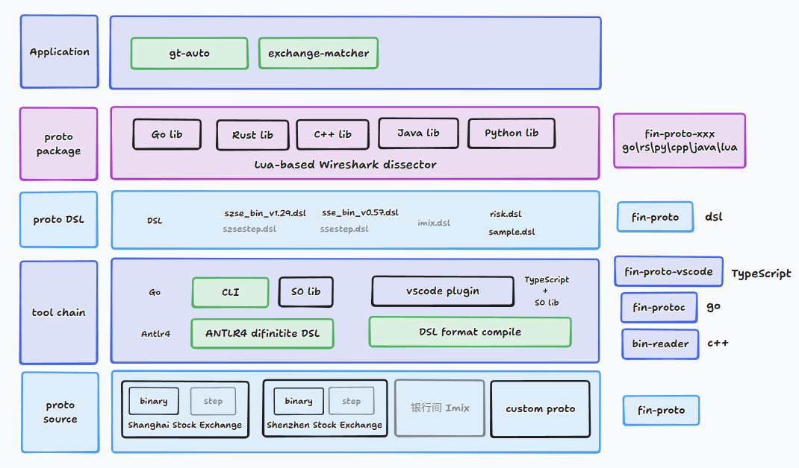

# 👋 Hi there, I'm Xinchen

Welcome to my GitHub profile!  
I'm passionate about technology, open source, and continuous learning.  
Here you'll find my technical notes, side projects, and contributions to the developer community.

  
   WeChat Official Account

## 🚀 About Me

- 🔭 Currently working on: [**fin-proto DSL**](https://github.com/xinchentechnote/fin-protoc) — a domain-specific language and compiler toolchain (`fin-protoc`) for defining and generating financial message protocols (e.g., SSE/ SZSE).
- 🌱 Currently learning: **Go** and **Rust** with a focus on compiler construction, protocol encoding/decoding, and multi-language code generation.
- 💬 Ask me about: **software testing**, **protocol parsing**, **binary serialization**, **backend development**, and **automation tools**.
- 🛠 Tech Stack: Rust, Go, Java, Python, TypeScript
- 📦 Projects:
  - `fin-proto-vscode`: A Visual Studio Code extension for `fin-proto` DSL, providing syntax highlighting, code snippets, and basic linting.
  - `fin-protoc`: A Go-based compiler that transforms `fin-proto` DSL into binary-safe code for multiple target languages.
  - `fin-proto`: A domain-specific language for defining financial message protocols, with a focus on SSE/SZSE binary formats.
    | Repository | Language | SSE (Shanghai) | SZSE (Shenzhen) | BJSE | HKEX | NASDAQ | NYSE | LSE |
    |-------------------|-------------|----------------|-----------------|------|------|--------|------|-----|
    | `fin-proto-rs` | Rust | ✓ | ✓ | ✓ | | | | |
    | `fin-proto-go` | Go | ✓ | ✓ | ✓ | | | | |
    | `fin-proto-cpp` | C++ | ✓ | ✓ | ✓ | | | | |
    | `fin-proto-java` | Java | ✓ | ✓ | ✓ | | | | |
    | `fin-proto-py` | Python | ✓ | ✓ | ✓ | | | | |
    | `fin-proto` | Lua & DSL | ✓ | ✓ | ✓ | | | | |
  - `bin-reader`: A Cpp-Base Cli tool for reading and parsing binary files, designed to handle complex binary formats with ease.
- 👀 Architecture Diagram of the Financial Protocol Toolchain System:
  
- 🧪 Interested in: Binary protocol simulation, testing tools, and low-latency messaging systems.

> 🚧 Always building. Always learning.

- ✍️ Blog: [https://xinchentechnote.github.io/note/](https://xinchentechnote.github.io/note/)

---

## 📊 GitHub Stats

---

## 🧰 Tools I Use

---

⭐️ From [xinchentechnote](https://github.com/xinchentechnote)
