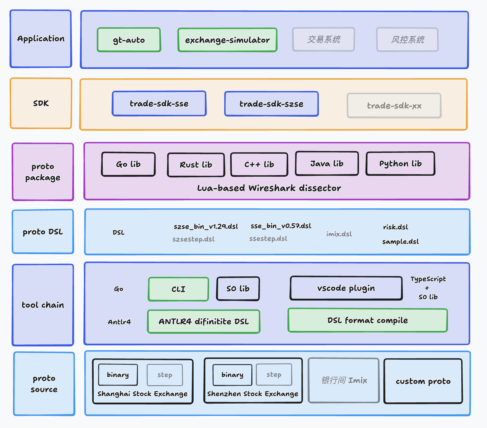

👋 你好呀，这里是歆晨技术笔记。

  
   微信公众号

🚀 关于我

• 🌱 正在做：分布式交易系统开发。

• 💬 可以与我交流：协议解析、自动化工具、金融交易风控后端开发相关问题。

• 🛠 技术栈：Rust、Go、Java、Python、TypeScript

• 📦 项目：

  - 交易所模撮合服务
    [exchange-simulator](https://github.com/xinchentechnote/exchange-simulator)
  - 端到端自动化测试工具
    [gt-auto](https://github.com/xinchentechnote/gt-auto)
  - 交易所sdk
    [trader-sdk-kava](https://github.com/xinchentechnote/trader-sdk-java)：沪深交易所二进制协议sdk java实现
    [trader-sdk-cpp](https://github.com/xinchentechnote/trader-sdk-cpp) : 沪深交易所二进制协议sdk c++实现
  - 交易协议实现
    [fin-proto-java](https://github.com/xinchentechnote/fin-proto-java)
    [fin-proto-cpp](https://github.com/xinchentechnote/fin-proto-cpp)
    [fin-proto-rs](https://github.com/xinchentechnote/fin-proto-rs)
    [fin-proto-go](https://github.com/xinchentechnote/fin-proto-go)
    [fin-proto-py](https://github.com/xinchentechnote/fin-proto-py)
  - 协议工具链
    [fin-proto-vscode](https://github.com/xinchentechnote/fin-proto-vscode)：面向 fin-proto DSL 的 VS Code 插件，提供语法高亮、代码片段和基础校验。

    [fin-protoc](https://github.com/xinchentechnote/fin-protoc)：基于 Go 的编译器，可将 fin-proto DSL 转换生成多语言的二进制协议包代码，支持c++、java、rust、go、python、lua等六种语言。

    [fin-proto](https://github.com/xinchentechnote/fin-proto)：定义金融报文协议的 DSL及对应的wireshark lua插件，覆盖沪深北交易所流式二进制协议。

    [bin-reader](https://github.com/xinchentechnote/bin-reader)：二进制数据阅读器，基于 C++ 的命令行工具。

• 👀 金融协议工具链系统架构图：

  

• ✍️ 博客：https://xinchentechnote.github.io/note/

📊 GitHub 数据

🧰 常用工具

